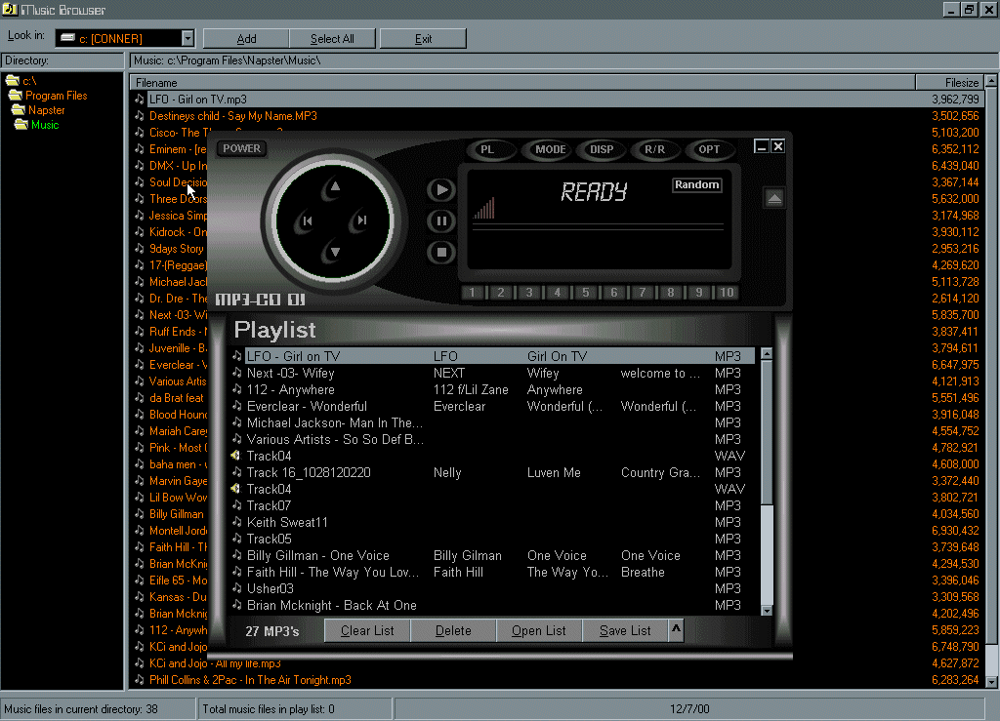



## MP3\-CD DJ v1\.0 BETA 2

### Description

This is a newer version of an MP3-CD player that I have submitted once before. Again the CD player part of it isn't working yet. You can choose your own color scheme and set your own preferences. There are also preset buttons that you can specify certain songs you want loaded everytime. Now with a better MP3/Wav music browser and with full code. Include my own progress bar, tray, and mouseover controls. Sorry, but it's not very commented at all. Don't dis me for that one. Give me some input and vote for me if you like it. Peace!
 
### More Info
 

             |
---                |---
**Submitted On**   |2002-01-19 10:48:50
**By**             |[ChoCho](https://github.com/Planet-Source-Code/PSCIndex/blob/master/ByAuthor/chocho.md)
**Level**          |Intermediate
**User Rating**    |4.8 (19 globes from 4 users)
**Compatibility**  |VB 6\.0
**Category**       |[Sound/MP3](https://github.com/Planet-Source-Code/PSCIndex/blob/master/ByCategory/sound-mp3__1-45.md)
**World**          |[Visual Basic](https://github.com/Planet-Source-Code/PSCIndex/blob/master/ByWorld/visual-basic.md)
**Archive File**   |[MP3\-CD\_DJ\_498541192002\.zip](https://github.com/Planet-Source-Code/chocho-mp3-cd-dj-v1-0-beta-2__1-13404/archive/master.zip)

